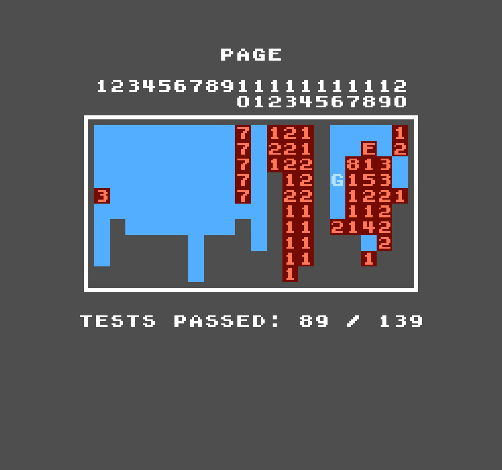

# ProcessingNES (PNES)
A Nintendo Entertainment System emulator written in Java using the Processing IDE.

The emulator currently passes `89 / 139` tests on the [AccuracyCoin](https://github.com/100thCoin/AccuracyCoin) test rom.

  

## Controls

| Action | Key |
| ------ | --- |
| D-Pad Left | `Left Arrow` |
| D-Pad Right | `Right Arrow` | 
| D-Pad Down | `Down Arrow` |
| D-Pad Up | `Up Arrow` |
| Start | `Enter` |
| Select | `Space` |
| B Button | `Z` |
| A Button | `X` |

## Mapper Support 
| Mapper|Support Status |
| ----- | ------------- |
| AxROM | Supported ✅ |
| CNROM | Supported ✅ |
| MMC1  | Supported ✅ |
| MMC2  |Unsupported ❌ (Planned)|
| MMC3  |Unsupported ❌ (Planned)|
| NROM  | Supported ✅ |
| UNROM | Supported ✅ |

Other mappers may partially function due to how .nes files are loaded in this emulator.
